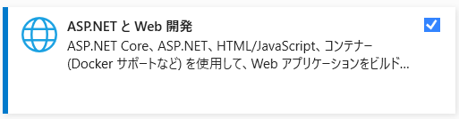
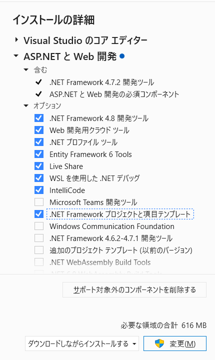

# .NET FrameworkでWebアプリを開発するための準備

## はじめに
Visual StudioでWeb開発するときに、Visual Studio Installerで「ASP.NETとWeb開発」を選択していると思います。 デフォルトでは、プロジェクトを新規作成するときに「ASP.NET Webアプリケーション（.NET Framework）」が候補に表示されません。 プロジェクトの候補に表示する方法を記載します。

## 環境
+ Windows 10 64bit
+ Visual Studio Community 2022

## 前提
「ASP.NETとWeb開発」がインストール済みであること

## 手順
1. Visual Studio Installerを立ち上げる
1. 「インストールの詳細」>「.NET Frameworkプロジェクトと項目テンプレート」をチェックする
1. 変更を実行する

