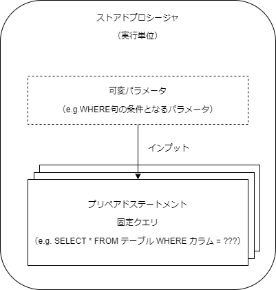

# データベース用語
使わないとすぐに忘れるため備忘としてまとめておく。

## 「ストアドプロシージャ」と「プリペアドステートメント」

### イメージ

### 参考サイト
[プリペアドステートメントおよびストアドプロシージャ](https://man.plustar.jp/php/pdo.prepared-statements.html)
[ストアドプロシージャとプリペアドステートメントの違いは？(日本語訳)](https://www.web-dev-qa-db-ja.com/ja/stored-procedures/%E3%82%B9%E3%83%88%E3%82%A2%E3%83%89%E3%83%97%E3%83%AD%E3%82%B7%E3%83%BC%E3%82%B8%E3%83%A3%E3%81%A8%E3%83%97%E3%83%AA%E3%83%9A%E3%82%A2%E3%83%89%E3%82%B9%E3%83%86%E3%83%BC%E3%83%88%E3%83%A1%E3%83%B3%E3%83%88%E3%81%AE%E9%81%95%E3%81%84%E3%81%AF%EF%BC%9F/940425037/)

### 「ODBC」と「OLE DB」

#### 参考サイト
[DAO、ADO、ODBC、OLE DBの違いを簡単にまとめる | YukiPress](https://mat0401.info/blog/dao-ado-odbc-oledb/)
[「ODBC」ドライバーと「OLE DB」プロバイダー～アクセス(Access)活用法](https://www.sk-access.com/mailmaga/vol394.html)
[SQLServerの接続方法を整理（OLEDB／ODBC） - Qiita](https://qiita.com/cloud-solution/items/1b89a7fba4d4ab78ceaf)
